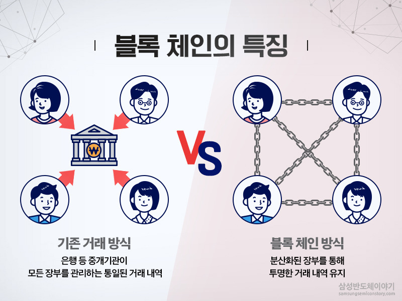
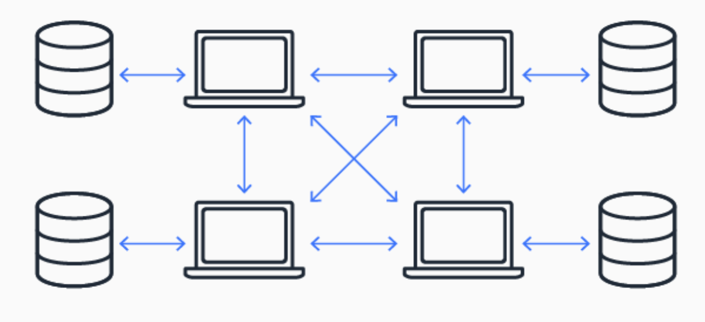
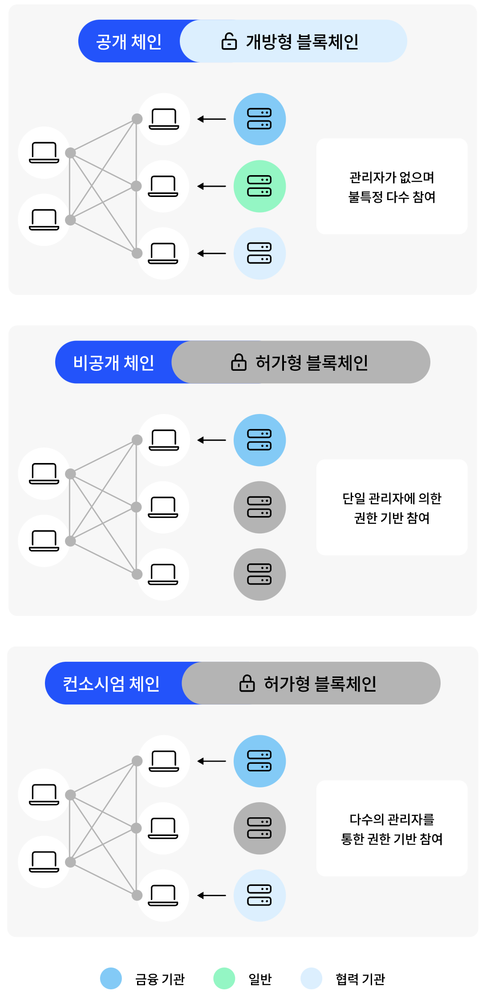
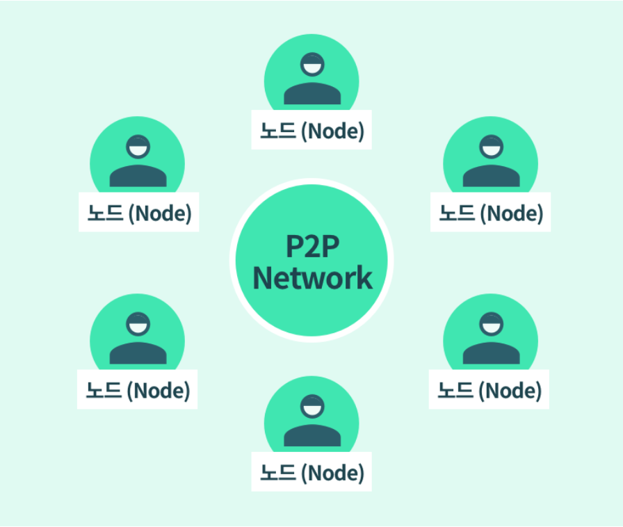

# Block Chain

> 작성자 : [배소라](https://github.com/sorayayat)

목차

- [블록체인이란](#블록체인blockchain이란)
- [블록체인의 작동원리](#블록체인-작동원리)
- [블록체인 기술](#블록체인-기술은-어떻게-발전했나요)

## 블록체인(Block Chain)이란?

블록체인이란 정보를 기록하고 저장하는 탈중앙화 시스템이다.  
일련의 순서로 연결된 데이터 단위(블록)로 구성된 일종의 분산 장부 기술이다.  
고급 데이터베이스 매커니즘으로 연쇄적으로 연결된 블록에 데이터를 저장하고 체인(노드)로 연결되어  
합의 없이 체인을 삭제하거나 수정 할 수 없기 때문에 일관성을 유지한다. 

### 블록체인이 왜 중요한가?

판매자 구매자 사이에 금전 거래가 발생했다고 가정하면, 돈을 받았는데도 받지 못했다고 하거나, 
구매자가 지불하지 않고 지불했다고 주장 할 수도 있다. 
잠재적으로 생길 수 있는 문제에 대해 제 3자가 감독, 검증을 해야하는데 이 중앙 기관을 존재는 거래를 복잡하게 하며 단일 취약점이라는 위험성과 중앙 데이터베이스가 손상된다면 많은 문제가 발생한다.  
블록체인은 거래를 기록하는 탈중앙화 변조 방지 시스템을 만들어 이러한 문제를 완화한다.
위와 같은 시나리오에서 __블록체인은 판매자와 구매자 각각에 대해 하나의 원장을 생성하고 양 당사자의 승인에 한해 원장에서 실시간 자동 업데이트가 된다.__

## 블록체인 작동원리

### 1단계 - 거래 기록

블록체인 거래는 블록체인 네트워크의 한 쪽에서 다른 쪽으로 물리적 또는 디지털 자산의 이동을 보여줍니다. 이는 데이터 블록으로 기록되며 다음과 같은 세부 정보를 포함할 수 있습니다.

- 거래에 참여한 사람은 누구인가요?
- 거래 중에 무슨 일이 일어났나요?
- 거래가 언제 발생했나요?
- 거래가 어디에서 발생했나요?
- 거래가 발생한 이유는 무엇인가요?
- 얼마나 많은 자산이 교환 되었나요?
- 거래 기간에 얼마나 많은 전제 조건이 충족되었나요?

### 2단계 – 합의 도출
분산 블록체인 네트워크의 참여자 대부분이 기록된 거래가 유효하다는 데 동의해야 합니다. 네트워크 유형에 따라 합의 규칙이 다를 수 있지만, 일반적으로 네트워크 시작 시 설정됩니다.

### 3단계 – 블록 연결
참여자가 합의에 도달하면 블록체인 거래가 원장 페이지와 동일한 블록에 기록됩니다. 거래와 함께 암호화 해시도 새 블록에 추가됩니다. 해시는 블록을 함께 연결하는 체인 역할을 합니다. 블록의 내용이 의도적 또는 비의도적으로 수정되면 해시 값이 변경되어 데이터 변조를 감지하는 방식을 제공합니다. 

따라서 블록과 체인은 안전하게 연결되며 수정될 수 없습니다. 각 추가 블록은 이전 블록 및 전체 블록체인의 검증을 강화합니다. 이는 나무 블록을 쌓아 탑을 만드는 것과 같습니다. 블록은 맨 위에만 쌓을 수 있으며, 탑 중앙에서 블록을 제거하면 탑 전체가 무너집니다.

### 4단계 – 원장 공유
시스템은 중앙 원장의 최신 사본을 모든 참가자에게 배포합니다.

 
 

--- 
## 블록체인 유형

---
### 블록체인 기술은 어떻게 발전했나요?
블록체인 기술은 1970년대 후반 Ralph Merkle이라는 컴퓨터 과학자가 **해시 트리 또는 Merkle 트리**에 대한 특허를 낸 데 뿌리를 두고 있습니다. 이 트리는 암호화된 블록을 연결하여 데이터를 저장하는 컴퓨터 과학 구조입니다. 1990년대 후반, Stuart Haber와 W. Scott Stornetta는 Merkle 트리를 사용하여 문서 타임스탬프를 변경할 수 없는 시스템을 구현했습니다. 이것이 블록체인 역사상 최초의 사례였습니다.

---
## 데이터베이스와 블록체인의 차이점은 무엇인가요?
블록체인은 일반 데이터베이스보다 많은 기능을 가진 특별한 유형의 데이터베이스 관리 시스템입니다. 다음 목록에서 기존 데이터베이스와 블록체인 간의 몇 가지 중요한 차이점을 설명합니다.

- 블록체인은 기존 데이터에 대한 신뢰를 손상시키지 않으면서 제어를 분산시킵니다. 이는 다른 데이터베이스 시스템에서 불가능합니다.
- 거래에 관련된 회사는 전체 데이터베이스를 공유할 수 없습니다. 하지만 블록체인 네트워크에서는 각 회사에 원장 사본이 있으며, 시스템은 자동으로 두 원장의 일관성을 유지합니다.
- 대부분의 데이터베이스 시스템에서는 데이터를 편집하거나 삭제할 수 있지만, 블록체인에서는 데이터를 삽입만 할 수 있습니다.

## 번외

### Bitcoin과 blookChin은 다르다?!

비트코인과 블록체인을 같은 의미로 사용될 수도 있지만.... 둘은 다르다. 
블록체인 기술이 처음 적용되서 사람들이 동일시 하기도 했지만 블록체인 기술이 적용되는 곳은 다양하다.

__Bitcoin은 중앙 집중식 통제 없이 작동하는 디지털 통화__ 입니다. Bitcoin은 원래 온라인으로 금융 거래를 하기 위해 만들어졌지만, 현재는 USD나 유로 등의 다른 글로벌 통화로 환전할 수 있는 디지털 자산으로 여겨집니다. 퍼블릭 Bitcoin ​​블록체인 네트워크는 중앙 원장을 생성하고 관리합니다. 

퍼블릭 원장은 모든 거래를 기록하고, 전 세계 서버들은 이 원장의 사본을 보유하고 있다. 

---

### 비트코인 채굴?

블록체인 기록을 다운로드 받으면 블록체인 P2P 네트워크의 일원으로서 이 기록을 가진 사람들이 '노드(Node)'라고 불리며, 각자가 금융기관의 역할을 하게 된다. 
이 노드의 과반수 이상이 동의 했을 때, 기록으로서 영구적으로 장부에 기록된다. 

과반수의 의한 합의라면 우리는 투표를 떠올릴 수 있는데 블록체인에 있어서는 **가장 많은 작업을 한 노드**가 권한을 더 많이 가지게 된다. 
이것이 바로 '작업증명(proof of Work)'라는 창시자가 고안한 블록 생성 방식이다. 
이 작업증명을 통해 블록에 거래 내역을 정리해주고 그 보상으로 코인과 거래 수수료를 받게 되는데 이것을 채굴이라고 한다. 
블록체인이 유지되기 위해 필요한 리소소를 제공하면, 이에 따른 보상을 받는 개념이다. 
