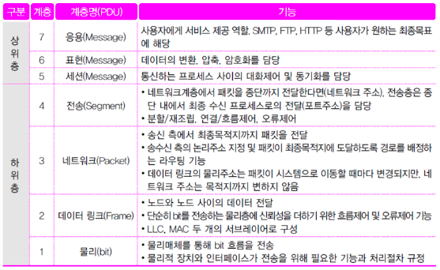

> 작성자 : [배소라](https://github.com/sorayayat)

목차

- [OSI 모형](#osi-모형)
- [Encapsulation & Decapsulation](#encapsulation--decapsulation)
- [OSI 7 계층](#osi_7_계층)

---

## OSI 모형

**OSI 모형(Open Systems Interconnection Reference Model)** 은 국제표준화기구(ISO)에서 개발한 모델로, 컴퓨터 네트워크 프로토콜 디자인과 통신을 계층으로 나누어 설명한 것이다. 일반적으로 OSI 7 계층이라고 한다.
OSI는 OSI 참조 모델, OSI 7계층 모델이라 흔히 말하는데 이 모델이 컴퓨팅 장치나 네트워크 장치를 설계할 때 
이 모델을 참조해서 만들기 위함이다.

### 사용이유

OSI 7 계층은 네트워크 통신의 복잡성을 추상화하고 모듈화하여 다른 프로토콜과 시스템들 간의 통신을 용이하게 만들어준다.  
통신이 일어나는 과정을 단계별로 파악할 수 있으며 문제 발생시 파악이 쉽고 수정 개선이 용이하다.
또한, 전 세계의 네트워크가 다른 네트워크와 통신하기 위해 표준화된 인터페이스를 제공하여 계층 간의 독립성을 유지하면서도 상호 연결 가능한 시스템을 구축할 수 있게 한다.

## Encapsulation & Decapsulation

사용자가 어떤 데이터를 응용 계층(최상위 계층)에서 생성하고 전송한다고 하면 데이터는 하위 계층으로 하나씩 내려가는데 각각의 층마다 다른 계층에서 처리한 데이터를 인식하도록 헤더를 붙인다. 이 과정을 __**캡슐화(Encapsulation)**__ 라고 한다.
즉, 최상위 계층에서 만들어진 데이터는 전송되기 전 물리 계층(1계층)에 도착했을 때 최소 6개의 헤더가 달린 상태가 된다는 것이다. 각 계층마다 캡슐화가 진행되기 때문이다. (2계층에서는 헤더뿐만 아니라 테일까지 붙인다.)

이 데이터는 물리 계층에서 0과 1로 이루어진 신호(Signal)로 변환되어 전송 매체(케이블 등)를 통해 다른 곳으로 전송된다. 이 신호를 받은 곳에서는 이 신호를 다시 원래 데이터의 모습으로 사용하기 위해 물리 계층부터 응용 계층까지 데이터를 올리게 되는데, 이 때 한 계층을 지날 때마다 방금 붙었던 헤더(와 테일)에 담긴 정보를 확인하고 난 뒤 떼내면서 데이터를 읽게 된다. 이 과정을 역캡슐화(Decapsulation)라고 한다.

 
 
 

## OSI_7_계층

1. 물리 계층(Physical Layer)
- 하는 일: 물리적 매체를 통해 0과 1의 비트 흐름을 전송하기 위해 요구되는 기능들을 조정한다.

- 장비: 케이블, 리피터, 허브

> 케이블과 같은 연결 장치를 사용하여 다른 장치와의 물리적인 연결을 수행하고, 이 연결을 바탕으로 전기 신호를 직접 전송하는 계층이다. 
이 계층에서 0과 1의 전압 및 케이블 사양 핀의 개수 등이 정의되어 있다. 이 계층은 별다른 알고리즘이나 오류 제어 기능은 없고 단순히 데이터 전달의 역할만을 수행하도록 설계되었다.

---
 

2. 데이터 링크 계층(Data Link Layer)
- 하는 일: 데이터 통신 과정에서 오류가 없도록 노드 대 노드 간 정보 전송의 신뢰성을 보장한다.

- 주요 프로토콜: CSMA/CD, LLC, Token Ring 등

- 데이터 전송 단위: 프레임(Frame)

- 장비: 브릿지, 스위치

> 데이터 링크 계층은 정보의 오류와 흐름을 관리하여 안정된 정보를 전달한다. 네트워크 계층(3계층)에서 전달받은 데이터에 그 정보의 주소와 제어 정보를 각각 **헤더와 테일**로 붙인다. 데이터 링크 계층에서 이렇게 전송하는 데이터의 전송 단위를 프레임(Frame)이라고 한다.

> 데이터 링크 계층의 대표적인 장비인 스위치는, 각 장치마다 MAC주소를 두어 정확한 장치로 데이터를 전송할 수 있도록 한다.

---
 

3. 네트워크 계층(Network Layer)
- 하는 일: 다중 네트워크 링크에서 패킷을 발신지로부터 목적지까지 성공적으로, 효과적으로 전달한다.

- 주요 프로토콜: IP, ICMP, IGMP, ARP 등

- 데이터 전송 단위: 패킷(Packet)

- 장비: 라우터

> 데이터 링크 계층에서 노드 대 노드 데이터 전달을 감독했다면 네트워크 계층은 데이터가 최종 목적지까지 어떤 경로를 통해 전달될 지 경로를 설정하는 역할을 한다. 네트워크 계층의 데이터 전송 단위를 패킷이라고 한다. 패킷을 최종 목적지까지 가장 빠르고 안전하게 전송할 수 있도록 하는 것이 네트워크 계층에서 하는 일이다. 이 과정을 라우팅이라고 하며, 라우터를 사용해서 이 기능을 수행한다.

---
 

4. 전송 계층(Transport Layer)
- 하는 일: 종단 간 정보 전송의 신뢰성을 보장하고, 오류를 복구하며, 흐름을 제어한다.

- 주요 프로토콜: TCP, UDP 등

- 데이터 전송 단위: 세그먼트(Segment), 데이터그램(Datagram; UDP에서)

- 장비: 게이트웨이

> 전송 계층에서는 발신지와 목적지, 양 종단 간 정보 전송의 신뢰성을 보장하고, 오류를 복구하며, 흐름을 제어한다. 여기서 신뢰성을 보장한다는 말은, 데이터가 정상적으로 전송됐는지 확인하고 정상적으로 전송되지 못한 데이터가 있다면 이를 재전송하여 누락되는 데이터가 없도록 보장한다는 의미다. 또한, 데이터 통신 과정에서 오류가 발생했을 경우 이를 해결하고, 각 데이터 전송의 흐름을 제어하는 역할을 하게 된다.

아래 5계층부터는 데이터 전송 단위를 전부 메시지/데이터라고 부르고, 소프트웨어를 통해서 구현되기 때문에 별도의 하드웨어 장비가 없다. 따라서 데이터 전송 단위와 장비에 대한 설명은 생략하도록 하겠다.

---
 

5. 세션 계층(Session Layer)
- 하는 일: 응용 프로세스를 통해 통신 세션을 구성한다.

- 주요 프로토콜: TLS, SSH

> 응용 프로세스를 통해 통신 세션을 구현한다는 말이 바로 이해가 가지 않는다면, 어플리케이션을 통해 포트 연결을 진행한다고 바꿔 읽어 보자. (사실 포트는 전송 계층과 세션 계층 사이에 있는 모호한 위치에 있지만, 이해하기 편하도록 포트 연결이라고 설명하도록 하겠다.) 세션 계층은 이 포트 연결을 통해 통신 장치 간의 상호작용을 설정하고, 유지하며, 동기화하는 역할을 한다.

---
 

6. 표현 계층(Presentation Layer)
- 하는 일: 운영체제를 통해 입출력되는 데이터를 다른 표현 형태로 변환한다.

- 주요 프로토콜: JPEG, MPEG, ASCII

> 표현 계층에서는 데이터를 다른 장치 모두가 이해할 수 있도록 번역을 한다. 다른 장치에서도 내가 보낸 데이터가 내가 보낸대로 일관되게 출력되도록 하기 위한 계층이다. 주요 프로토콜의 JPEG, MPEG를 보면 쉽게 이해할 수 있는데, 내 휴대폰을 통해 보낸 JPG 확장자의 사진이 다른 장치에서도 똑같아 보이는 이유가, 다른 장치의 표현 계층에서 통신 과정에서 얻은 데이터의 번역을 수행했기 때문이라고 생각하면 이해하기 편하다.

---
 

7. 응용 계층(Application Layer)
- 하는 일: 사용자와 직접 상호작용하며 인터페이스 역할을 수행한다. 각 프로세스 간의 정보 교환을 담당한다.

- 주요 프로토콜: DHCP, DNS, FTP, HTTP

> 응용 계층은 우리들이 사용하는 대부분의 프로그램들이 있는 계층이다. 동영상 재생 프로그램이나 인터넷 브라우저 등 우리가 자주 사용하는 프로그램들 또한 이 이 계층에 포함되어 사용자가 네트워크에 접근할 수 있도록 도와주는 기능을 수행한다.
