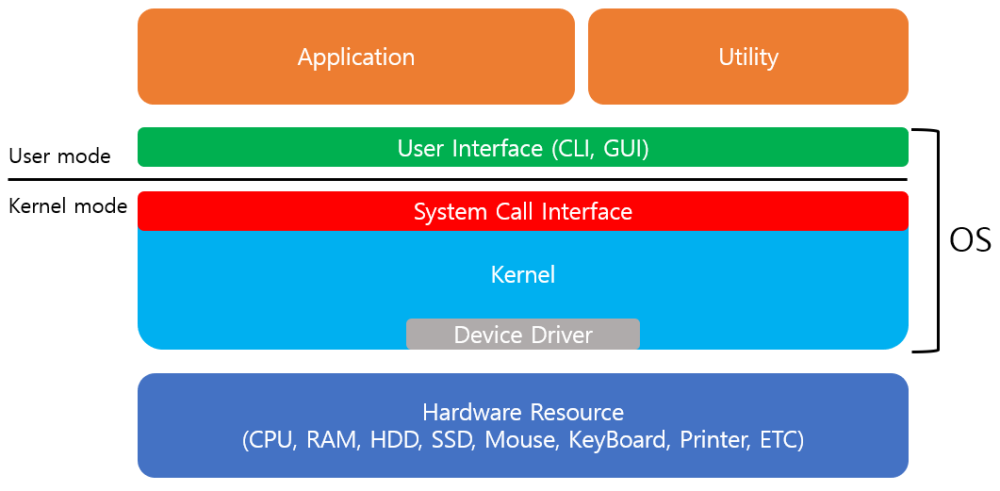
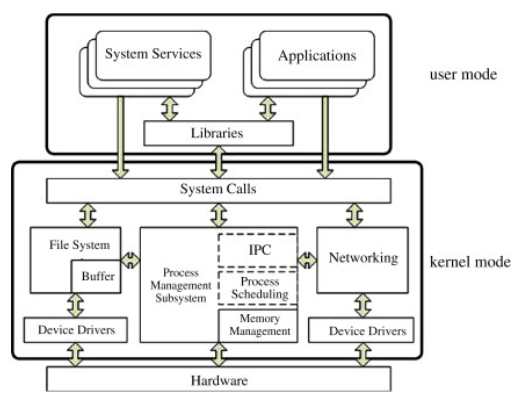
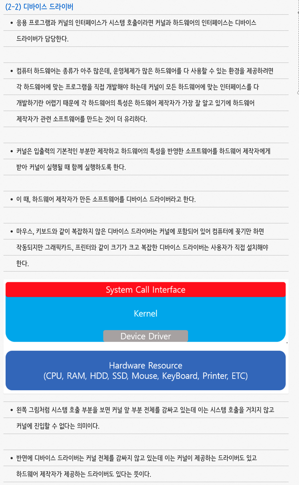

# Operating System

> 작성자 : [배소라](https://github.com/sorayayat)
### os 구조 - 커널? 운영체제?! 뭔데?!?!

1) 운영체재의 구조

os 그림1

- 운영체재란 컴퓨터 시스템의 자원들을 효율적으로 관리해주며 사용자가 컴퓨터를 효과적으로 사용 할 수 있도록 환경을 제공하는 **여러 프로그램들의 모음**

- 커널과 인터페이스를 분리하여 같은 커널을 사용하더라도 다른 인터페이스의 형태로 제작할 수 있다.

커널구조 그림2

2) 커널의 시스템 호출

- 커널이 자신을 보호하기 위해 직접 접근하는 것을 차단한다. -> 시스템 호출이라는 인터페이스로 접근
- 시스템 호출을 이용해 커널이 데이터를 가져오거나 저장하는 것을 책임지기 때문에 컴퓨터 자원 관리가 수월해진다. (응용 프로그램이 바로 접근 할 수 있다면 다른 사람이 내 데이터를 손상 시킬 수 있다.)

- 운영체제는 커널이 제공하는 서비스를 시스템 호출로 제한하고 다른 방법으로 들어오지 못하게 컴퓨터 자원을 보호한다.

- 2-1) 디바이스 드라이버
